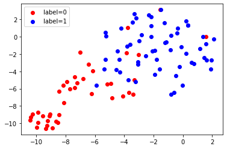

# AI for COPD


## 简介
本项目开发了一个基于AutoGluon的COPD病人院内死亡概率及住院时长预测模型。

## 环境
```Bash
# for AutoGluon
pip install -U pip
pip install -U setuptools wheel
pip install autogluon

# for Embeddingvisualization
pip install numpy
pip install warnings
pip install matplotlib.pyplot 

# for txt2excel
pip install openpyxl
pip install codecs

# for ExcelIntergration
pip install pandas
pip install xlwt
pip install openpyxl

```

## 说明
[txt2excel.py](txt2excel.py)  
将HX信息科、检验科等科室导出的txt文件转化为excel文件。

[ExcelIntergration.py](ExcelIntergration.py)  
将多个excel中相同登记号的病人信息（如检查结果、检验结果、诊断等）整合到一个excel中。

[LOSPrediction.py](./src/LOSPrediction.py)  
依据病例中的文本信息实现对COPD病人住院时长的预测。  
数据集格式：
| index |                                text                                  | label |
|:-----:|:--------------------------------------------------------------------:|:-----:|
| 0     | The patient's gender is male, the patient's age is 84 years old...   | long     |
| 1     | The patient's gender is female, the patient's age is 66 years old... | short    |
| 2     | The patient's gender is male, the patient's age is 96 years old...   | short    |

[MortalityPrediction.py](./src/MortalityPrediction.py)  
根据表格化的检查检验数据实现对COPD病人院内死亡率的预测。  
数据集格式：
| index |    BMI   |   PCT  | age | ..... | label |
|:-----:|:--------:|:------:|:---:|:-----:|:-----:|
| 0     | 16.73111 | 1.1904 | 51  | ..... | 1     |
| 1     | 21.42774 | 0.07   | 67  | ..... | 1     |
| 2     | 31.61177 | <0.02  | 60  | ..... | 0     |

[Embeddingvisualization.py](./src/Embeddingvisualization.py)  
使用TSNE来可视化神经网络提取的嵌入，其中的每一个集群对应一个标签，例如下面label=0代表院内死亡病人，label=1代表未死亡病人。  


